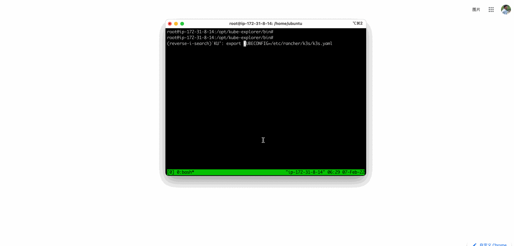

# kube-explorer

kube-explorer is a portable explorer for Kubernetes without any dependency.

It integrates the Rancher steve framework and its dashboard, and is recompiled, packaged, compressed, and provides an almost completely stateless Kubernetes resource manager.

## Usage ✅

Please download the binary from the [release page](https://github.com/cnrancher/kube-explorer/releases).

To run an HTTP only server:

```bash
./kube-explorer --kubeconfig=xxxx --http-listen-port=9898 --https-listen-port=0
```

Then, open the browser to visit http://x.x.x.x:9898 .



## Build ✅

To debug on an AMD64 Linux host:

```bash
make dev

# $basedir=/opt/ui/dist/
# prepare the file trees like this
# $basedir/dashboard/
# $basedir/api-ui/
# $basedir/index.html

# good to go!
./bin/kube-explorer --debug  --ui-path /opt/ui/dist/ --http-listen-port=9898 --https-listen-port=0
```

To build all cross-platform binaries:

```bash
CROSS=tag make
```

## Supported features

- Specified system default registry for shell image, e.g. `--system-default-registry`
- Specified shell image name, e.g. `--pod-image`
- Deployed behind proxy
  - [Behind ingress with dns name](./deploy/kubectl/README.md)
  - [Behind ingress with dns name and path prefix](./deploy/kubectl/path-prefix/Readme.md)
  - Base auth via ingress such as [nginx](./deploy/kubectl/nginx-auth/README.md), [traefik-v1](./deploy/kubectl/traefik-v1-auth/README.md) and [traefik-v2](./deploy/kubectl/traefik-v2-auth/README.md)

## Support Matrix

Currently, there are several major versions under maintenance, each tailored to different Kubernetes version ranges due to the use of varying steve and client-go versions.

| Major | Target Rancher Branch | K8s version range |
| ----- | --------------------- | ----------------- |
| v0.4  | v2.8.x                | >= 1.25 <= 1.28   |
| v0.5  | v2.9.x                | >= 1.27 <= 1.30   |

Please use the proper kube-explorer version for your k8s setup.

## Related Projects

- kube-explorer ui([https://github.com/cnrancher/kube-explorer-ui](https://github.com/cnrancher/kube-explorer-ui))
- autok3s([https://github.com/cnrancher/autok3s](https://github.com/cnrancher/autok3s))
- api-ui([https://github.com/rancher/api-ui](https://github.com/rancher/api-ui))
